# Hi 👋, I'm Braian

### ***About me***

I'm a cybersecurity enthusiast focused on offensive security and system administration. I'm currently working through Hack The Box Academy modules (binary exploitation, shellcoding, DNS enumeration) and building out my own home lab with Wazuh, Docker and VMware. I love breaking things to understand how they really work, and then documenting it so I don't forget.

- 🌱 I'm currently learning...
  * Binary exploitation & shellcoding (x86-64 assembly)
  * Active Directory attacks
  * Advanced networking (DNS, VPN pivoting)
- 🔭 I'm currently working on...
  * A home SOC lab (Wazuh + OpenSearch + custom Python alert engine)
- 👯 I'm looking forward to collaborate on open source security tooling.
- 💻 My daily driver is Arch Linux + BSPWM, configured from scratch via `nvim`.
- ✔ Ask me about Linux, pentesting, or home labs — happy to help.
- 📫 Reach out to me at: **tu-email@ejemplo.com**

## My Skills Include

#### Languages & Scripting

#### Security & Tools

#### Other Tools & Technologies

## Check out my Social Media

